# Guía de Configuración CI/CD con AWS Amplify

## 📚 Tabla de Contenidos

- [Resumen de la Arquitectura](#resumen-de-la-arquitectura)
- [Ventajas del Monorepo](#ventajas-del-monorepo)
- [Pre-requisitos](#pre-requisitos)
- [Configuración en AWS Amplify](#configuración-en-aws-amplify)
- [Configuración de GitHub Secrets](#configuración-de-github-secrets)
- [Deploy Selectivo](#deploy-selectivo)
- [Variables de Entorno](#variables-de-entorno)
- [Troubleshooting](#troubleshooting)

## 🏗️ Resumen de la Arquitectura

### Estructura del Monorepo

```
frontend-lq/
├── apps/
│   ├── student-teacher/    # Nuxt.js 4 (SSG/SSR)
│   └── institutional/       # Vite + Vue (SPA)
├── packages/
│   ├── composables/        # Compartido
│   ├── graphql/            # Compartido
│   ├── i18n/               # Compartido
│   ├── stores/             # Compartido
│   ├── ui/                 # Compartido
│   └── utils/              # Compartido
└── .github/workflows/      # CI/CD workflows
```

### Flujo de Deploy

```mermaid
graph LR
    A[Push a main/develop] --> B{Detectar cambios}
    B -->|apps/student-teacher/** cambió| C[Deploy Student-Teacher]
    B -->|apps/institutional/** cambió| D[Deploy Institutional]
    B -->|packages/** cambió| E[Deploy ambas apps]
    C --> F[Amplify Student-Teacher]
    D --> G[Amplify Institutional]
    E --> F
    E --> G
```



## ✅ Ventajas del Monorepo

### 1. **Código Compartido**

- Componentes UI reutilizables
- Lógica de negocio unificada
- Configuración de GraphQL compartida
- Stores y composables comunes

### 2. **Deploy Atómico**

Si actualizas `@lq/ui`:

- ✅ Ambas apps se actualizan al mismo tiempo
- ✅ No hay inconsistencias entre versiones
- ✅ Un solo PR para ambas apps

### 3. **Optimización con Turbo**

- Cache inteligente de builds
- Solo reconstruye lo que cambió
- Builds paralelos cuando es posible

### 4. **Evita Fallos Desincronizados**

En repositorios separados:

- ❌ Una app podría fallar y la otra no
- ❌ Difícil sincronizar cambios breaking

En monorepo:

- ✅ Si falla, falla en ambas (detectas problemas temprano)
- ✅ Los cambios breaking se manejan en un solo PR

## 📋 Pre-requisitos

### 1. Cuentas y Accesos

- [ ] Cuenta de AWS con acceso a Amplify
- [ ] Repositorio GitHub conectado
- [ ] Permisos para crear IAM users/roles

### 2. Herramientas Locales

```bash
node --version  # >= 24.11.1
pnpm --version  # >= 10.15.1
```

## 🚀 Configuración en AWS Amplify

### Paso 1: Crear las Aplicaciones en Amplify

#### Para Student-Teacher:

1. Ve a [AWS Amplify Console](https://console.aws.amazon.com/amplify/)
2. Click en **"New app" > "Host web app"**
3. Conecta tu repositorio GitHub
4. Configuración:
   - **App name**: `lingoquest-student-teacher`
   - **Repository branch**: `main`
   - **Monorepo**: ✅ Enabled
   - **App root directory**: `apps/student-teacher`
   - **Build settings**: Detecta automáticamente `amplify.yml`

5. **Build settings** (editar si es necesario):

   ```yaml
   version: 1
   applications:
     - appRoot: apps/student-teacher
       frontend:
         phases:
           preBuild:
             commands:
               - cd ../..
               - corepack enable
               - corepack prepare pnpm@10.15.1 --activate
               - pnpm install --frozen-lockfile
           build:
             commands:
               - pnpm build:student-teacher
         artifacts:
           baseDirectory: apps/student-teacher/.output/public
           files:
             - "**/*"
         cache:
           paths:
             - node_modules/**/*
             - .turbo/**/*
   ```

6. Click **"Save and deploy"**

#### Para Institutional:

Repite los mismos pasos pero con:

- **App name**: `lingoquest-institutional`
- **App root directory**: `apps/institutional`
- **Build artifacts directory**: `apps/institutional/dist`

### Paso 2: Configurar Variables de Entorno en Amplify

Para cada app, ve a **App settings > Environment variables**:

```bash
# Común para ambas apps
NODE_ENV=production
GRAPHQL_ENDPOINT=https://api.lingoquest.com/graphql/
NODE_OPTIONS=--max_old_space_size=4096

# Específicos por app (ejemplo)
VITE_API_URL=https://api.lingoquest.com
NUXT_PUBLIC_API_URL=https://api.lingoquest.com
```

### Paso 3: Configurar Build Settings

#### Importante para pnpm + monorepo:

1. Ve a **App settings > Build settings**
2. Edita **Build image settings**:
   - **Build image**: `Amazon Linux 2023` (más reciente)
   - **Live package updates**: ✅ Enabled

3. Añade **Build environment variables**:

   ```
   _CUSTOM_IMAGE=public.ecr.aws/docker/library/node:24-alpine
   ```

   Esto asegura que Amplify use la versión correcta de Node.js.

### Paso 4: Habilitar Auto-Deploy Selectivo

#### Opción 1: Path-based triggers (Recomendado)

1. Ve a **App settings > Monorepo settings**
2. Para `student-teacher`:
   - **Watch paths**:
     ```
     apps/student-teacher/**
     packages/**
     pnpm-lock.yaml
     turbo.json
     ```

3. Para `institutional`:
   - **Watch paths**:
     ```
     apps/institutional/**
     packages/**
     pnpm-lock.yaml
     turbo.json
     ```

#### Opción 2: GitHub Actions (Mayor control)

Los workflows en [.github/workflows/](.github/workflows/) ya tienen configurado `paths:` para deploy selectivo.

## 🔐 Configuración de GitHub Secrets

### 1. Crear IAM User para CI/CD

```bash
# Política IAM requerida (amplify-cicd-policy.json)
{
  "Version": "2012-10-17",
  "Statement": [
    {
      "Effect": "Allow",
      "Action": [
        "amplify:StartJob",
        "amplify:GetJob"
      ],
      "Resource": [
        "arn:aws:amplify:us-east-1:YOUR_ACCOUNT_ID:apps/STUDENT_TEACHER_APP_ID/*",
        "arn:aws:amplify:us-east-1:YOUR_ACCOUNT_ID:apps/INSTITUTIONAL_APP_ID/*"
      ]
    }
  ]
}
```

Crear usuario:

```bash
aws iam create-user --user-name github-amplify-cicd
aws iam put-user-policy --user-name github-amplify-cicd \
  --policy-name AmplifyDeployPolicy \
  --policy-document file://amplify-cicd-policy.json
aws iam create-access-key --user-name github-amplify-cicd
```

### 2. Añadir Secrets en GitHub

Ve a **Settings > Secrets and variables > Actions** y añade:

```
AWS_ACCESS_KEY_ID=AKIA...
AWS_SECRET_ACCESS_KEY=...
AMPLIFY_APP_ID_STUDENT_TEACHER=d1234abcd...
AMPLIFY_APP_ID_INSTITUTIONAL=d5678efgh...
```

## 🎯 Deploy Selectivo: Cómo Funciona

### Escenario 1: Solo cambia Student-Teacher

```bash
git commit -m "feat: add quiz feature to student app"
# Modificaciones en: apps/student-teacher/pages/quiz.vue
```

**Resultado**:

- ✅ Se dispara workflow `amplify-student-teacher.yml`
- ❌ NO se dispara `amplify-institutional.yml`

### Escenario 2: Cambio en paquete compartido

```bash
git commit -m "fix: update button component in @lq/ui"
# Modificaciones en: packages/ui/components/Button.vue
```

**Resultado**:

- ✅ Se disparan AMBOS workflows
- ✅ Ambas apps se actualizan con el componente arreglado

### Escenario 3: Actualización de dependencias

```bash
pnpm add vue@latest
# Modificaciones en: pnpm-lock.yaml
```

**Resultado**:

- ✅ Se disparan AMBOS workflows
- ✅ Ambas apps reconstruyen con las nuevas dependencias

### Escenario 4: Cambio solo en docs

```bash
git commit -m "docs: update README"
# Modificaciones en: README.md
```

**Resultado**:

- ❌ NO se dispara ningún workflow
- ℹ️ No afecta las apps

## 🔧 Variables de Entorno

### Variables Comunes (ambas apps)

Añádelas en **Amplify Console > Environment variables**:

```bash
NODE_ENV=production
GRAPHQL_ENDPOINT=https://api.lingoquest.com/graphql/
SENTRY_DSN=https://...
```

### Variables Específicas

#### Student-Teacher (Nuxt.js)

```bash
NUXT_PUBLIC_API_URL=https://api.lingoquest.com
NUXT_PUBLIC_APP_NAME=LingoQuest Student
```

#### Institutional (Vite)

```bash
VITE_API_URL=https://api.lingoquest.com
VITE_APP_NAME=LingoQuest Institutional
```

## 🐛 Troubleshooting

### Error: "pnpm: command not found"

**Solución**: Añade en `amplify.yml`:

```yaml
preBuild:
  commands:
    - corepack enable
    - corepack prepare pnpm@10.15.1 --activate
    - pnpm install --frozen-lockfile
```

### Error: "Out of memory" durante build

**Solución**: Aumenta memoria en `amplify.yml`:

```yaml
build:
  commands:
    - export NODE_OPTIONS=--max_old_space_size=4096
    - pnpm build:student-teacher
```

### Error: Workspace dependencies no se encuentran

**Solución**: Asegúrate de instalar desde la raíz:

```yaml
preBuild:
  commands:
    - cd ../.. # Volver a la raíz del monorepo
    - pnpm install --frozen-lockfile
```

### Los cambios en packages/ no disparan deploy

**Verifica**:

1. En GitHub Actions: el `paths:` incluye `packages/**`
2. En Amplify Console: el "Watch paths" incluye `packages/**`

### Build exitoso pero la app no se actualiza

**Revisa**:

1. El `baseDirectory` en `amplify.yml` apunta al directorio correcto
2. Para Nuxt: `apps/student-teacher/.output/public`
3. Para Vite: `apps/institutional/dist`

## 📊 Monitoreo y Logs

### Ver logs de build:

1. Amplify Console > App > Branch > Click en el build
2. O usa AWS CLI:
   ```bash
   aws amplify get-job \
     --app-id d1234abcd \
     --branch-name main \
     --job-id 1
   ```

### Métricas importantes:

- **Build duration**: Debería ser < 5 minutos con cache
- **Deploy frequency**: Track en GitHub Actions
- **Success rate**: Objetivo > 95%

## 🚀 Comandos Útiles

### Desplegar manualmente desde GitHub Actions:

```bash
gh workflow run amplify-student-teacher.yml
gh workflow run amplify-institutional.yml
```

### Invalidar cache de Turbo:

```bash
pnpm clean
rm -rf .turbo
```

### Build local para test:

```bash
# Student-Teacher
pnpm build:student-teacher
pnpm --filter @lq/student-teacher preview

# Institutional
pnpm build:institutional
pnpm --filter @lq/institutional preview
```

## 📚 Recursos Adicionales

- [AWS Amplify Hosting Docs](https://docs.aws.amazon.com/amplify/latest/userguide/welcome.html)
- [Monorepo Support in Amplify](https://docs.aws.amazon.com/amplify/latest/userguide/monorepo-configuration.html)
- [Turbo Documentation](https://turbo.build/repo/docs)
- [pnpm Workspaces](https://pnpm.io/workspaces)

---

## ✅ Checklist Final

Antes de hacer el primer deploy:

- [ ] Ambas apps creadas en Amplify Console
- [ ] `amplify.yml` configurado en cada app
- [ ] Variables de entorno configuradas
- [ ] GitHub Secrets añadidos
- [ ] Path-based triggers configurados
- [ ] Build exitoso en local para ambas apps
- [ ] Test en branch `develop` antes de `main`
